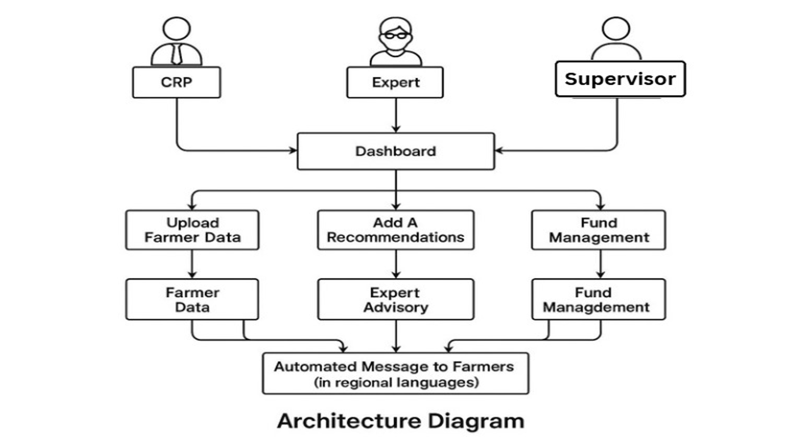
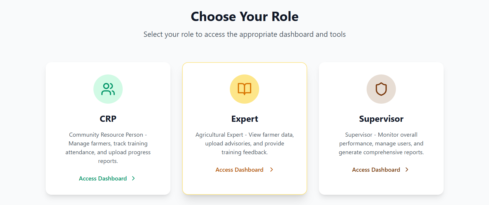
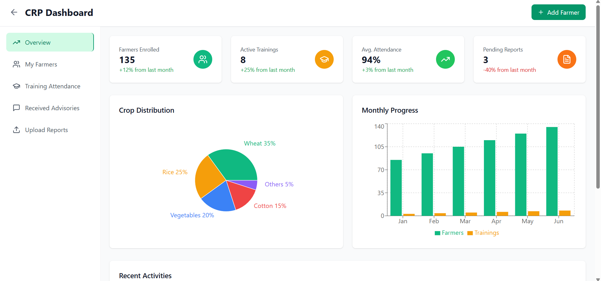
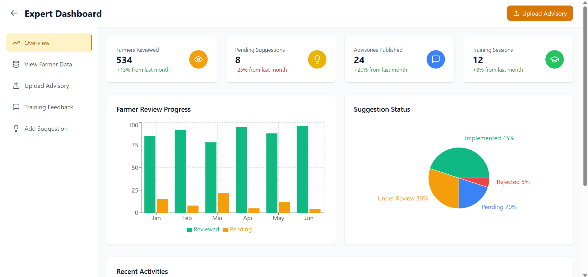
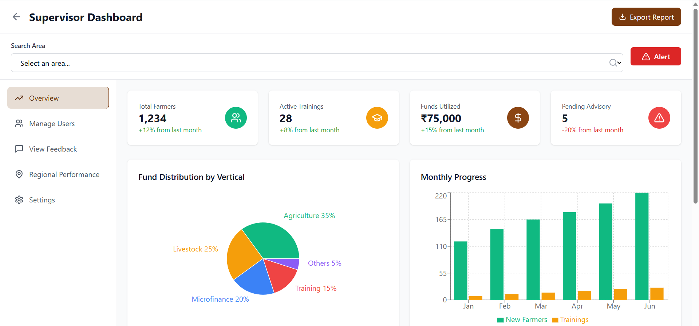

# Centre of Microfinance & Livelihood Platform  
*An Initiative of TATA TRUSTS*  
*Built at JPMC Code for Good Hackathon – Hyderabad (Team 25)*

## 🌱 Project Overview

This project aims to digitize and streamline the operations of the Centre of Microfinance & Livelihood. Designed for use by Community Resource Persons (CRPs), agriculture experts, and supervisors, the platform addresses key issues such as:

- Manual data collection  
- Lack of real-time visibility  
- Inefficient fund allocation  
- Missed communication with farmers  
- Absence of a centralized system

## 🧠 Key Features

- 🎯 **AI-Driven Crop Health & Disease Forecasting**  
- 📩 **Bulk SMS Alerts** using APIs like Fast2SMS  
- 📊 **Role-Based Dashboards** for CRPs, Experts, and Supervisors  
- 📈 **Supervisor Analysis Panel** – Impact of trainings, fund needs, region-wise engagement  
- 🛰️ **Real-Time Monitoring & Data Sync**

---

## 🔄 Functional Flow  
An end-to-end view of how data flows across the system, from CRP collection to expert analysis and supervisor reporting.

---

## 👥 Stakeholder Login & Access  
Each stakeholder (CRP, Expert, Supervisor) has a **separate login panel** and can only access features relevant to their role.  

✅ **Secure Signup** is enabled via **unique stakeholder codes** to prevent unauthorized access.

---

## 🖥️ Dashboards Showcase

### 🔹 CRP Dashboard  

### 🔹 Expert Dashboard  

### 🔹 Supervisor Dashboard  

---

## 🛠️ Tech Stack

- **Frontend:** React.js  
- **Backend:** Node.js, Express.js  
- **Database:** MongoDB  
- **AI Module:** Python  
- **Communication:** Fast2SMS API

---

## 🔮 Future Scope

- Regional government scheme integration  
- Offline-first features  
- More tribal language support  
- Android app for CRPs

---

## 🤝 Team 25 – CFG Hyderabad

We built this in 24 hours with collaboration, creativity, and a passion to empower rural India.

<!-- write packages used -->